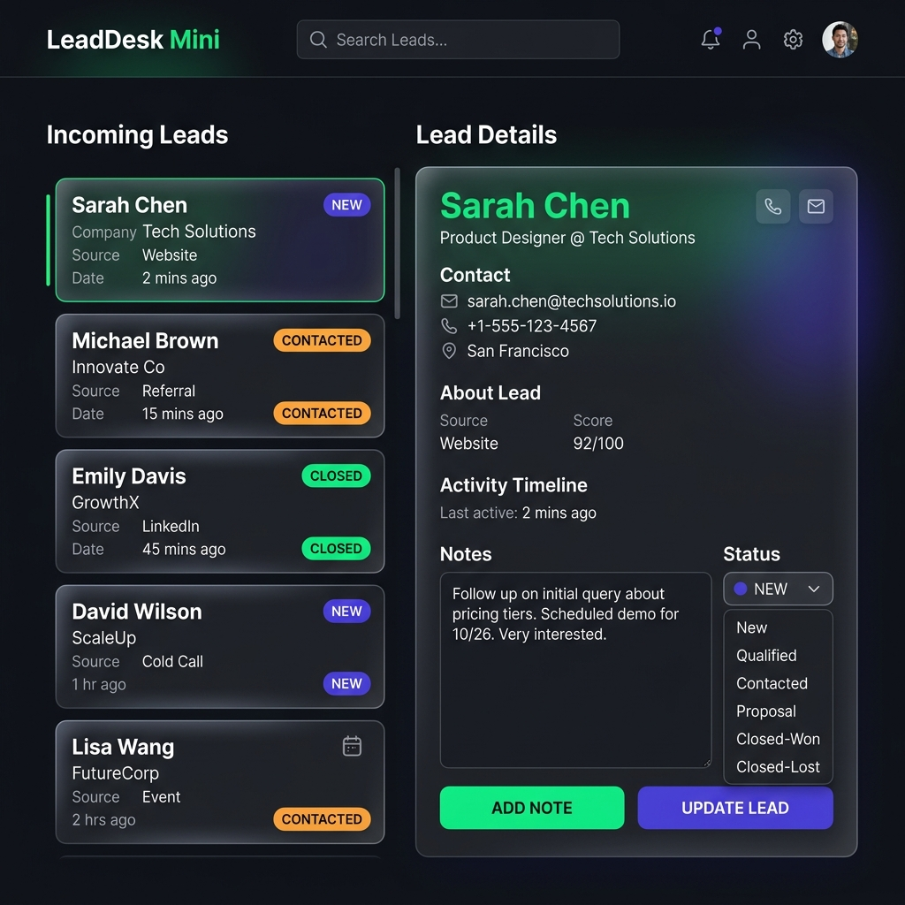
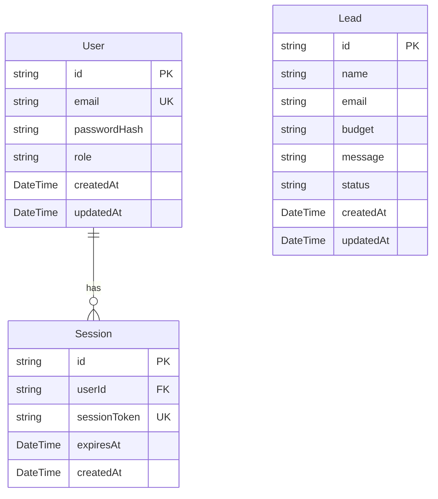

# LeadDesk Mini

An elite, secure, and performant lead capture application and pipeline management console built with Next.js (App Router, React 19), Tailwind CSS, and Prisma 7 ORM connecting to a Neon PostgreSQL database.

<div align="center">
  <br />
  
  [](https://lead-desk-mini-mu.vercel.app/)
  &nbsp;
  [](https://lead-desk-mini-mu.vercel.app/login)
  &nbsp;
  [](https://www.typescriptlang.org/)
  
  [](https://www.prisma.io/)
  &nbsp;
  [](https://neon.tech/)
 
<br/>

<br/>

</div>

---

## 🔗 Live Deploy & Access Links

*   **Public Landing Page:** [https://lead-desk-mini-mu.vercel.app/](https://lead-desk-mini-mu.vercel.app/)
*   **Admin Console:** [https://lead-desk-mini-mu.vercel.app/admin](https://lead-desk-mini-mu.vercel.app/admin)
*   **Admin Login Link:** [https://lead-desk-mini-mu.vercel.app/login](https://lead-desk-mini-mu.vercel.app/login)

---

## 🔑 Recruiter Sandbox Credentials

To test the admin console and pipeline management panel, use the following pre-seeded sandbox credentials:

*   **Email:** `admin@leaddesk.com`
*   **Password:** `AdminPass123!`

> [!NOTE]
> **Professional Security Disclaimer:**
> These credentials are provided strictly for evaluation testing. In a production environment, default accounts are disabled in favor of dynamic administrator invitation flows, and secret strings are managed securely via cloud environment parameters rather than committed configurations.

---

## 🛠️ Architecture & Core Features

*   **Optimized Lead Capture Form:** An elegant, dark-themed public interface featuring smooth transitions. Validates form inputs on both client and server layers using Zod schemas.
*   **Responsive Control Panel:** Responsive pipeline interface that renders as a tabular layout on desktops and automatically collapses into individual grid cards on mobile screens (fully supporting screens down to 320px).
*   **Inline Mutations:** State changes (New $\rightarrow$ Contacted $\rightarrow$ Closed) are managed inline via secure server actions and saved dynamically into the Neon database.
*   **Debounced Pipelines:** Real-time query search backed by a 300ms debounce cycle and status filtering tabs to handle large volumes of lead records efficiently.

---

## 📊 Data Model Schema

The data layer uses three core models built with PostgreSQL:



---

## 🔒 Custom Authentication & Security Design

We implemented a custom cookie-based database session store rather than heavy third-party providers (like Auth.js or Clerk), keeping the architecture clean and lightweight:

1.  **Hashed Passwords:** User passwords are encrypted using `bcryptjs` with 12 salt rounds before database storage.
2.  **HttpOnly Cookies:** Active sessions write a secure cryptographically random token to the database and place it in the browser's cookie jar with `httpOnly: true`, `secure: true` (HTTPS only), and `sameSite: "lax"` policies (mitigating XSS and CSRF).
3.  **Session Rotation:** Whenever an admin verifies their session, the application checks if the token lifetime is half-expired. If so, it automatically extends the expiration date in the database and rotates the cookie.
4.  **Edge-Safe Route Guard:** 
    *   **Edge Middleware (`src/proxy.ts`):** Standard database drivers cannot be run in the Edge runtime. To bypass this Next.js constraint, the proxy middleware does a fast verification checks to see if the session cookie is present. If missing, it immediately redirects to `/login` before rendering routes.
    *   **Node Server Layer (`src/app/admin/page.tsx`):** The Server Component retrieves the cookie, queries the Neon database via Prisma to confirm the token is valid, active, and belongs to an `ADMIN`. If validation fails, it deletes the cookie and redirects the user.

---

## 💻 Local Setup & Development

### 1. Prerequisites
- Node.js (v18.x or higher)
- A Neon PostgreSQL or local database connection string

### 2. Environment Configuration
Create a `.env` file in the root of the project:

```env
DATABASE_URL="your-postgresql-connection-string"
ADMIN_EMAIL="admin@leaddesk.com"
ADMIN_PASSWORD="AdminPass123!"
SESSION_SECRET="e9a2b8e3a5f4c672d89b1c0e3f4a5b6c7d8e9f0a1b2c3d4e5f6a7b8c9d0e1f2a"
```

### 3. Quick Start Commands

```bash
# Clone the repository
git clone https://github.com/RaghavParasher/LeadDesk-Mini.git
cd LeadDesk-Mini

# Install dependencies
npm install

# Push schema to database
npx prisma db push

# Seed admin user credentials
node prisma/seed.js

# Launch local dev server
npm run dev
```
Open [http://localhost:3000](http://localhost:3000) in your browser.
