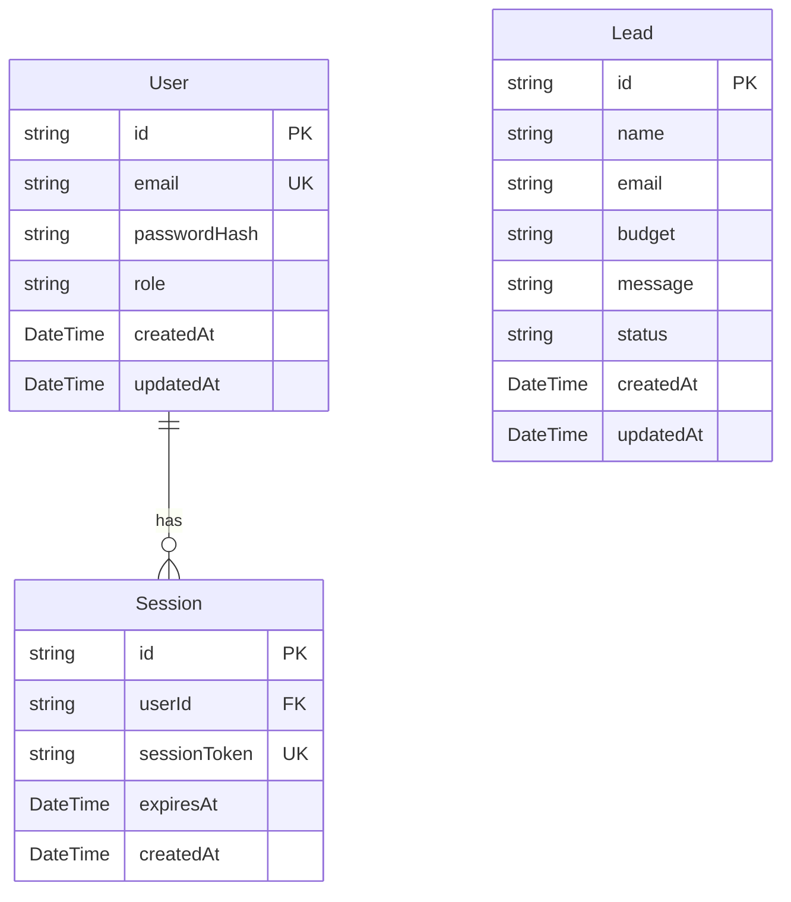

# LeadDesk Mini

A secure, high-fidelity, and performant lead capture application and pipeline management console built with Next.js (App Router), Tailwind CSS, and Prisma ORM connecting to a Neon PostgreSQL database.

## Architecture & Features

- **Lead Capture Form:** Public-facing landing page with responsive forms, client-side/server-side validations via Zod schemas, and instant feedback.
- **Admin Dashboard:** Pipeline console with debounced query search, status filters, and real-time inline status mutations (New / Contacted / Closed).
- **Responsive Layout:** Minimalist design adhering to a 4px/8px grid system, rendering tabular views on desktop and collapsing into cards on mobile.
- **Robust Security:** Zero hardcoded credentials, custom secure cookies, and route guards.

---

## Data Model

The application models data with three core tables in PostgreSQL using Prisma ORM:



### Table Breakdown
1. **User:** Holds administrative user accounts. Passwords are encrypted with `bcryptjs` (salt rounds: 12) before storage.
2. **Session:** Stores active session states. Maps users to random session tokens, validating lifetimes and enabling absolute session revocation.
3. **Lead:** Stores inquiry forms. Budgets are stored as ranges and status represents the current funnel state (`New`, `Contacted`, or `Closed`).

---

## Authentication & Route Guard Strategy

This application utilizes a custom database-backed session-cookie mechanism to achieve secure, stateful session control without external framework bloat:

1. **Authentication Flow:**
   - On submitting credentials, the server validates fields against a Zod login schema.
   - It retrieves the user from the database and compares passwords using `bcrypt.compare`.
   - If valid, a cryptographically secure random session token is generated, stored in the `Session` database table, and set as a cookie.
2. **Secure Session Cookie Configuration:**
   - **`httpOnly: true`** - Block client-side JavaScript access (mitigates XSS attacks).
   - **`secure: true`** (in production) - Force cookies to be sent only over HTTPS.
   - **`sameSite: "lax"`** - Prevent cross-site request forgery (CSRF) on cross-origin navigations.
   - **Expiration** - Sessions expire after 24 hours. The cookie lifetime is aligned with this value.
3. **Session Rotation:**
   - To keep users active seamlessly while mitigating session hijacking, the verification utility checks if the session is half-expired. If so, it automatically extends the expiration date in the database and updates the browser cookie.
4. **Edge-Safe Route Protection:**
   - Protection is configured in `middleware.ts`. Because Next.js Middleware runs in the Edge Runtime, direct database imports are blocked.
   - **Edge Layer:** The middleware performs a fast check for the existence of the `leaddesk_session` cookie. If it is completely missing, the request is immediately redirected to `/login` before executing server-side components.
   - **Node.js Layer:** In `/admin/page.tsx`, the Server Component retrieves the cookie, queries the Neon database via Prisma to confirm the token is valid, active, and belongs to an `ADMIN`. If validation fails, it safely deletes the cookie and redirects to `/login`.

---

## Getting Started

### Prerequisites
- Node.js (v18.x or higher)
- A PostgreSQL database connection string (e.g. from Neon or Supabase)

### Environment Variables
Create a `.env` file in the root directory:

```env
DATABASE_URL="your-postgresql-connection-string"
ADMIN_EMAIL="admin@leaddesk.com"
ADMIN_PASSWORD="YourSecurePasswordHere123!"
SESSION_SECRET="your-32-char-random-string"
```

### Installation
1. Clone the repository and install dependencies:
   ```bash
   git clone https://github.com/RaghavParasher/LeadDesk-Mini.git
   cd LeadDesk-Mini
   npm install
   ```

2. Initialize and sync the database schema:
   ```bash
   npx prisma db push
   ```

3. Seed the default admin user:
   ```bash
   node prisma/seed.js
   ```

4. Run the development server:
   ```bash
   npm run dev
   ```
   Open [http://localhost:3000](http://localhost:3000) in your browser.

---

## Production Build & Testing

- **Verify production compile:**
  ```bash
  npm run build
  ```
- **Launch production server:**
  ```bash
  npm start
  ```
